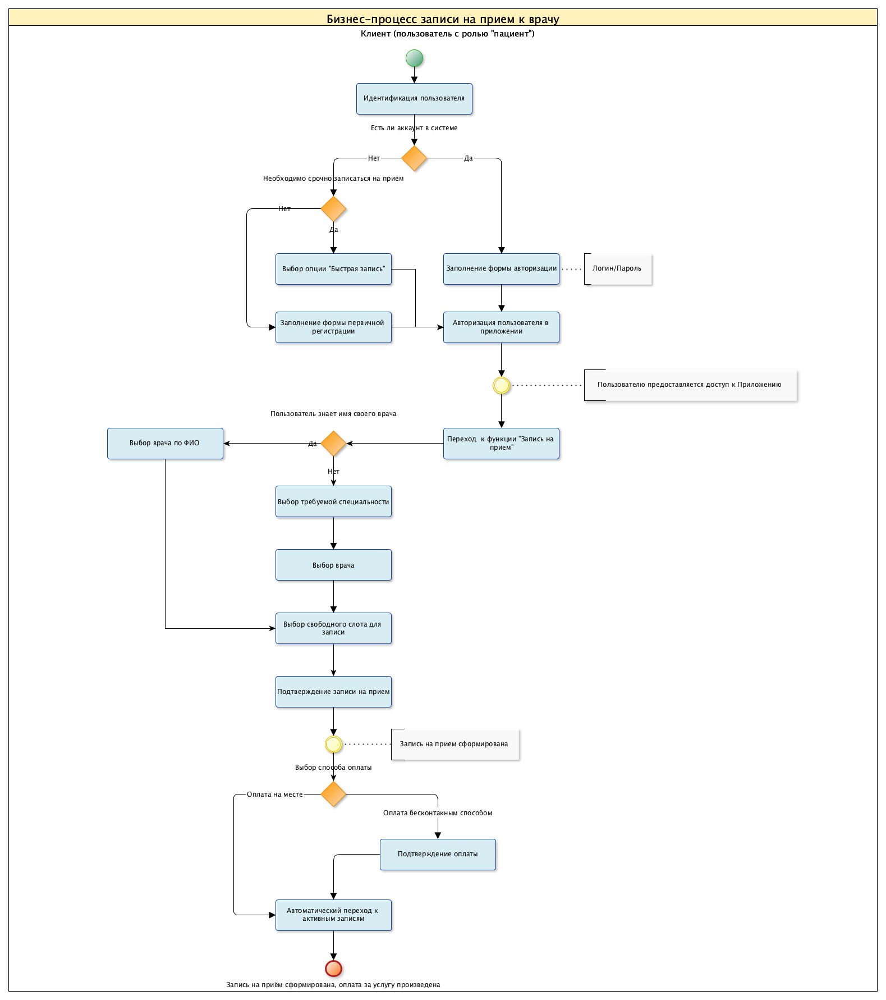

# ТЕСТОВОЕ ЗАДАНИЕ. ATLAS

1. [Уточнение потребностей](#I.-Уточнение-потребностей-клиентов-/-клиники)
   1. [Вопросы для клиентов](#Клиенты)
   2. [Вопросы для клиники](#Клиника)
2. [Бизнес-процесс записи на приём](#II.-Бизнес-процесс-записи-на-приём)
   1. [Блок-схема](#Блок-схема)
   2. [Описание бизнес-процесса записи на прием](#Описание-бизнес-процесса-записи-на-прием)
   3. [Взаимодействие с API и необходимые данные](#Взаимодействие-с-API-и-необходимые-данные)
   4. [Новый функционал для улучшения UX](#Новый-функционал-для-улучшения-UX)
3. [Требования к приемке задачи](#III.-Требования-к-приемке-задачи)
   1. [Состав функции "Запись на прием"](#Состав-функции-"Запись-на-прием")
   2. [Критерии приемки функционала по UX/UI и логике работы](#Критерии-приемки-функционала-по-UX/UI-и-логике-работы)

## I. Уточнение потребностей клиентов / клиники

### Клиенты

1. Какой вариант записи на приём клиенту предпочтительнее: посредством полной регистрации (с возможностью получения всего спектра услуг клиники) или быстрая запись на приём?
   1. Наличие данной функции позволит клиенту взаимодействовать с клиникой, исходя из конкретных обстоятельств. 
2. Какой облик приложения для клиента предпочтительнее: которое ассоциируется с медициной или которое имеет отвлеченный внешний вид, похожий на обычный сервис?
   1. Опрос поможет сформировать требование к дизайну приложения.-
3. Важно ли клиенту видеть фотографию врача в приложении во время записи на прием?
   1. На текущий момент МИС не передает фотографию врачей, однако такая практика позволяет повысить доверие между пациентом и врачом, тем самым повысив лояльность клиента клинике. 
4. Существуют ли персональные данные, которые клиенты хотели бы скрыть от клиники / лечащего врача? Если да, то какие?
   1. Если такие данные есть, то можно добавить для пользователя функцию "скрыть данные", которая будет распространяться на личные сведения (личный профиль) и показатели здоровья пациента (конкретные разделы медкарты).
5. Какой канал коммуникации с клиникой клиенту было бы удобно использовать: телефон, обратный звонок, email, чат в приложении?
6.  Нужно ли клиенту получать уведомления о статусных событиях (успешная запись на приём, причина невозможности осуществить запись, изменения в записи?
    1.  Если уведомления нужны, то по каким каналам было бы удобно получать информацию (push, sms, email)?
7. Удобно ли было бы сообщить клинике о причинах обращения через интерактивные анкеты / чат-бота?
   1. Наличие такого функционала позволило бы пациенту максимально точно информировать клинику о причинах своего обращения. Также такой подход может быть эффективным для составления анамнеза и сопровождения пациента после приема. 
8.  Нужно ли клиенту иметь личный кабинет в приложении для получения дополнительных функций?
   2.  Если клиент нужно только записаться на прием, то ему была бы полезна опция "быстрой" записи (без полной регистрации в приложении).
9.  Клиенту нужен поиск специалистов по всем поликлиникам, либо только по той, к которой он прикреплён?
10. Клиенту нужен раздел «избранное» для сохранения специалистов? 
    1.  Функция позволит сохранить понравившихся специалистов и упростить процесс поиска врачей в дальнейшем. Кроме того это может быть полезно клиенту в случае, если его лечащий врач сменил фамилию или уволился. 
11. Клиенту нужен доступ к своей электронной медицинской карте? 
    1.  Если да, то можно разработать раздел,  в котором будет выводится информация из медицинской карты, а также актуальные назначения и рецепты.
12. Нужно ли клиенту сохранить банковские карты как способ оплаты? 
    1.  Если клиент готов сохранять свои банковские карты в приложении, то в разделе "Способы оплаты" он может выбирать активную банковскую карту для упрощения процесса записи.
13. Интересен ли клиенту депозитный счёт в клинике, который позволяет оплачивать услуги со скидкой?
    1.  Можно создать счет в разделе платежей для получения услуг на льготных условиях. 
14. Клиент пользуется электронным календарем на своем мобильном устройстве? 
    1.  После создания записи можно предлагать клиенту добавить событие "посещение врача" в мобильный календарь. 

### Клиника

1. Возможно ли полностью оформить клиента удаленным образом (во время первичного обращения)?
   1. В этом случае можно все необходимые сведения собрать во время регистрации пользователя в приложении.
2. На каком этапе первичного посещения пациента поликлинике требуется заведение медицинской карты?
3. Какие сведения о пациенте нужны поликлинике в первую очередь перед (во время) приёмом?
4. Отображать ли данные из электронной медицинской карты клиенту?
   1. Если не существует никаких ограничений, то возможна реализации функции по отображению для клиента сведений из медицинской карты в приложении.
5. Требуется ли клинике раздел для управления расписанием врача через личный кабинет специалиста?
   1. Возможно клиника уже использует внутреннюю систему для управления расписанием врачей, в таком случае разработка доплонительного модуля не обязательна.
6. Какой способ оплаты (на месте/бесконтактный) предпочтительнее?
   1. Если у клиники есть возможность для оплаты услуг на месте, то клиенты смогут оплачивать услуги не только в момент записи, но и на месте. 
7. Существует ли у клиники матрица стоимости услуг, которая регулярно обновляется (Зависит ли стоимость приёма от конкретного специалиста, его категории, или стоимость определяется только видом услуг)?
   1. Это определит логику работы функции по назначению цен на услуги клиники.
8. Какой диапазон дат предлагать клиенту для записи (неделя / две недели / месяц / без ограничений)? 
9. Чем больше диапазон дат, тем больше у клиента возможностей для записи. Однако большой диапазон накладывает высокие требование на предоставление клиникой актуальных сведений о расписании врачей.
10. За какое время до начала приёма клиент может записаться?
    1.  Если клиника не накладывает никаких ограничений, то клиент сможет записаться за минуту до приема.

## II. Бизнес-процесс записи на приём

### Блок-схема

Ниже представлен бизнес-процесс записи на прием с позиции клиента клиники:

### Описание бизнес-процесса записи на прием

1. Выбрать один из доступных вариантов записи на прием: 
   1. Авторизация для зарегистрированных пользователей Логин/пароль 
   2. Быстрая запись
   3. Первичная регистрация
2. Указать логин и пароль для авторизации пользователя в приложении.
   1. Если выбрана быстрая запись, указать номер телефона. 
   2. Если выбрана первичная регистрация, указать обязательные поля: ФИО, дата рождения, номер телефона, электронная почта.
3. Автоматический переход в приложение, в случае успешной авторизации.
4. Выбор функции "Запись на прием"
5. Выбор требуемой специализации
   1. Если известно имя конкретного врача, то перейти к пункту 7.
6. Выбор профиля конкретного врача 
7. Выбор свободного слота для записи
8. Подтверждение записи на прием
9.  Выбор способа оплаты посещения [На месте / Оплата картой]
   1. Если оплата в клинике, перейти к пункту 12.
10. Подтверждение данных банковской карты, оплата услуг.
   2. Если возникли проблемы с оплатой карты, возврат к пункту 9.
11. Уведомление пользователя об успешном завершении процедуры оплаты услуг
12. Уведомление пользователя об успешном завершении процедуры записи на прием
13. Завершение бизнес-процесса записи на прием

### Взаимодействие с API и необходимые данные

*Взаимодействие с API будет рассматриваться разрабатываемых экранов приложения*

#### Авторизация пользователя [0]

Данные из формы логина в приложение:

Название атрибута | Системное название из документа на интеграцию | Комментарий
------------- | ------------- | ----
Логин | - | почта/телефон
Пароль  | - | произвольный

#### Экран "Выбор специализации" [1]

Предлагается реализовать новый endpoint `GET /api/specialities`, по которому можно будет получить доступные специализации врачей. 

Состав данных:

Название атрибута | Системное название из документа на интеграцию 
------------- | -------------
Id специализации | KEYID
Специализация  | SHORTTEXT

Кроме того на данном экране предполагается использование панели поиска по конкретным ФИО врачей, для этого будет использоваться endpoint `GET /api/doctors`. 

Для решения данной задачи состав данных должен быть следующий:

Название атрибута | Системное название из документа на интеграцию 
------------- | -------------
Id врача | KEYID
ФИО врача  | TEXT

#### Экран "Выбор врача" [2]

Для реализации данного экрана требуются сведения о враче и его расписание. Для получения данных о профиле врача должен использоваться endopoint `GET /api/doctors/{id}`.

Состав данных:

Название атрибута | Системное название из документа на интеграцию 
------------- | -------------
Id врача | KEYID
ФИО врача  | TEXT
Фотография врача  | отсутствует в API
Должность  | POSITIONID
Категория сотрудника | UCATEGID
Тип персонала | STAFFID
Степень | DEGREE
Специализация | SPECID
Клиника приема | DEPID
Стоимость услуги | payserv.AMOUNT

Данные о расписании врача должны предоставляться по точке `GET /api/schedule?doctor_id={id}`

Расписания с учетом фильтрации по дате и времени должны предоставляться по точке `GET /api/schedule?dt={timestamp}`

Состав данных:

Название атрибута | Системное название из документа на интеграцию 
------------- | -------------
Id врача | DOCDEP.KEYID
Дата проведения приема | FDAYID
Время начала приема | DAT
Продолжительность приема | MINS
День недели | DAYNUM
Клиника приема | DEPARTMENT_ID
Место проведения приема  (адрес?)| PLACEID
Кабинет приема  | ROOM_ID

#### Экран "Профиль врача" [3]

Для функционирования этого экрана используются данные, полученные на предыдущем экране [2].

#### Отправка запроса на создание записи

Для формирования записи на прием нужно использовать `POST /api/appointment`.

Состав передаваемых данных:

Название атрибута | Системное название из документа на интеграцию 
------------- | -------------
Id пациента | PATIENT.KEYID
ФИО пациента | PATIENT.LASTNAME + PATIENT.FIRSTNAME + PATIENT.SECONDNAME
Id врача | DOCDEP.KEYID
Дата проведения приема | FDAYID
Время начала приема | DAT
Продолжительность приема | MINS
День недели | DAYNUM
Клиника приема | DEPARTMENT_ID
Место проведения приема  (адрес?)| PLACEID
Кабинет приема  | ROOM_ID

#### Экран "Оплата услуг" [5]

В структуре данных, предоставляемых МИС нет сведений о банковских картах клиентов, поэтому для выбора способа оплаты потребуется реализовать новый API, например, `GET /api/payment_methods?client_id={id}`.

Требуемые данные (конфиденциальные):

Название атрибута | 
------------- | 
Номер карты | 
Срок действия карты | 
Имя владельца карты | 

#### Экран "Мои записи" [6]

Для получения данных по записям предлагается реализовать новый endpoint `GET /api/appointments?client_id={id}`

Cостав данных:

Название атрибута | Системное название из документа на интеграцию 
------------- | -------------
Id пациента | PATIENT.KEYID
ФИО пациента | PATIENT.LASTNAME + PATIENT.FIRSTNAME + PATIENT.SECONDNAME
Id врача | DOCDEP.KEYID
Дата проведения приема | FDAYID
Время начала приема | DAT
Продолжительность приема | MINS
День недели | DAYNUM
Клиника приема | DEPARTMENT_ID
Место проведения приема  (адрес?)| PLACEID
Кабинет приема  | ROOM_ID

### Новый функционал для улучшения UX

Часть предложений уже описана в разделе 3 (требования к приемке), также некоторые из предложений рассматриваются в вопросах к клиентам и клинике.

Ниже представлены еще некоторые идеи:

#### QR представление для записей

Предлагается выводить на экран QR-код со всеми необходимыми данными. Для срочного получения информации на стойке ресепшн в клинике.

#### Сохранение черновика записи 

Предлагается сохранить записи после выбора слота. Функция позволит вернутся клиенту к выбранной записи, в случае неуспешной оплаты. Если оплата подтверждается, то запись клиента отображается в соответствующем разделе.

#### Избранные врачи

Список врачей, которых пользователь отобрал для быстрого доступа в дальнейшем.

# III. Требования к приемке задачи

## Состав функции "Запись на прием"

**Бизнес цель** - обеспечить клиенту возможность записи на прием через мобильное приложение.

### Ключевые возможности функции для пользователя с ролью "пациент":

- Доступ к функции "Запись к врачу";
- Фильтрация параметров поиска врача: поликлиника, специальность врача, дата приема, времени приема;
- Получение информацию о враче: ФИО, специальность врача, место работы, категория сотрудника, тип персонала, степень;
- Получение информации о расписании конкретного врача;
- Выбор способов оплаты: оплатить услугу на месте, оплатить услугу через приложение;
- Оплата услуги через приложение;
- Просмотр активных записей в соответствующем разделе приложения;

### Перечень экранов:

*Приводится список экранов, необходимых для реализации функции "Запись на прием"*

- Экран авторизации и аутентификации [0]
- Экран "Главное меню" [00] ***дорабатывается, указан для навигации по документу.***
- Экран "Выбор специализации" [1]
- Экран "Выбор врача" [2]
- Экран "Профиль врача" [3]
- Экран "Подтверждение записи на прием" [4]
- Экран "Оплата услуг" [5]
- Экран "Мои записи" [6]

## Критерии приемки функционала по UX/UI и логике работы

### Доступ к функции "Запись к врачу". Экран авторизации и аутентификации [0]

- Должно быть реализовано окно входа в приложение:
  - Логин/пароль для зарегистрированных пользователей
  - Номер телефона для быстрой записи
  - Первичная регистрация по указанию обязательных полей: ФИО, дата рождения, номер телефона, электронная почта.
- Пользователь обязательно авторизуется в приложении с ролью "пациент" в случаях, если:
  - Пользователь зарегистрирован в Приложении.
  - Пользователь вошел в приложение для быстрой записи на прием.
  - Пользователь прошел первичную регистрацию.
- Зарегистрированный пользователь может восстановить пароль, указав номер телефона и дату рождения.
- После успешной авторизации пользователь попадает в главное меню приложения [00]. 

### Требования к экрану "Главное меню" [00]

- В главном меню должна быть кнопка / раздел, явно указывающая на переход к функции "Запись на прием".
- После нажатия на кнопку осуществляется переход на экран `"Выбор специализации" [1]`.

### Требования к экрану "Выбор специализации" [1]

- Выводится список доступных специализаций врачей.
- Должен быть реализован поиск по имени врача: пользователь может перейти к профилю конкретного врача, выбрав один из предложенных вариантов после создания запроса на поиск в соответствующем поле. Панель поиска, расположена в верхней части экрана.
- По нажатию на специализацию осуществляется переход к экрану `[2]`.
- По выбору элемента (врача) из выпадающего списка панели поиска осуществляется переход к экрану `[3]`.

### Требования к экрану "Выбор врача" [2]

- Выводится список врачей в виде карточек.
- Каждая карточка содержит следующую информацию о враче: ФИО, фотография и свободные для записи слоты на ближайший день.
- Структура списка:
  - Элементы списка сгруппированы по двум ближайшим дням приема (уровень 1).
  - Внутри уровня 1 происходит группировка врачей по поликлиникам (уровень 2).
  - Внутри уровня 2 находится список врачей.
- Сортировка:
  - Уровень 1 - по ближайшему дню.
  - Уровень 2 - по названию поликлиники.
  - Уровень 3 - по врачам с ближайшим свободным слотом для записи. На этом уровне выводится карточка врача. 
- Нажатие на карточку (не кнопку со слотом) переводит на экран `"Профиль врача" [3]`.
- Нажатие на слот переводит на экран `"Подтверждение записи на прием" [4]`.
- Кнопка "параметры фильтрации" активирует панель, на которой доступна фильтрация по параметрам. После выбора параметров необходимо подтвердить запрос нажатием на кнопку "фильтровать". После подтверждения список врачей будет обновлен. Список параметров:
  - Поликлинике (список доступных поликлиник)
  - Дате приема (указание диапазона дат через виджет-календарь)
  - Времени приема (выбор диапазонов из предложенных (например: 06:00-12:00)

### Требования к экрану "Профиль врача" [3]

- Выводится подробная информация о враче (блок "инфо о враче"):
  - Фотография (?)
  - ФИО
  - Специализация
  - Клиники приема
  - Категория сотрудника
  - Тип персонала
  - Степень
- Отображаются доступные для записи слоты (блок "расписание врача"):
  - Слоты сгруппированы и отсортированы по дням (сначала ближайшие).
- По нажатию на слот осуществляется переход на экран `"Подтверждение записи на прием" [4]`

### Требования к экрану "Подтверждение записи на прием" [4]

- Отображается:
  - Информация о времени приема:
    - Время начала приема
    - Время окончания приема
    - День недели, дата.
  - Краткая информация о враче:
    - Специальность
    - ФИО
  - Информация о месте приема:
    - Кабинет приема
    - Адрес поликлиники
    - Название поликлиники
  - Выбор способа оплаты:
    - Оплата на месте
    - Оплата картой
- По нажатию на кнопку "Записаться" и выборе опции "Оплата картой" осуществляется переход на экран `"Оплата услуг [5]`. В случае выбора опции "Оплата на месте" автоматически открывается экран `"Мои записи" [6]` и выводится сообщение "Вы успешно записаны на прием".

### Требования к экрану "Оплата услуг" [5]

- Интерфейс для выбора существующих методов оплаты (ранее использованные для оплаты банковские карты).
- Интерфейс для ввода данных нового метода оплаты.
- Выбор приложения для бесконтактной оплты Google Pay, Apple Pay, Samsung Pay и т.д
- После подтверждение метода оплаты пользователем и успешного подтверждения платежа банковской системой осуществляется автоматический переход на экран `"Мои записи" [6]` и выводится сообщение "Вы успешно записаны на прием". 
- В случае, если банковская система отказывает в проведении платежа, приложение предлагает выбрать другой метода оплаты.

### Требования к экрану "Мои записи" [6]

- Записи отображаются в виде списка. Каждый элемент которой содержит общую информацию о записи:
  - Дата приема
  - Время приема
  - Специализация врача
  - ФИО врача
  - Клиника
  - Кабинет
- Все записи сгруппированы на две группы: активные и архивные.
- Сначала отображается список активных записей
- Для активных записей пользователю доступны опции отмены и переноса записи. 